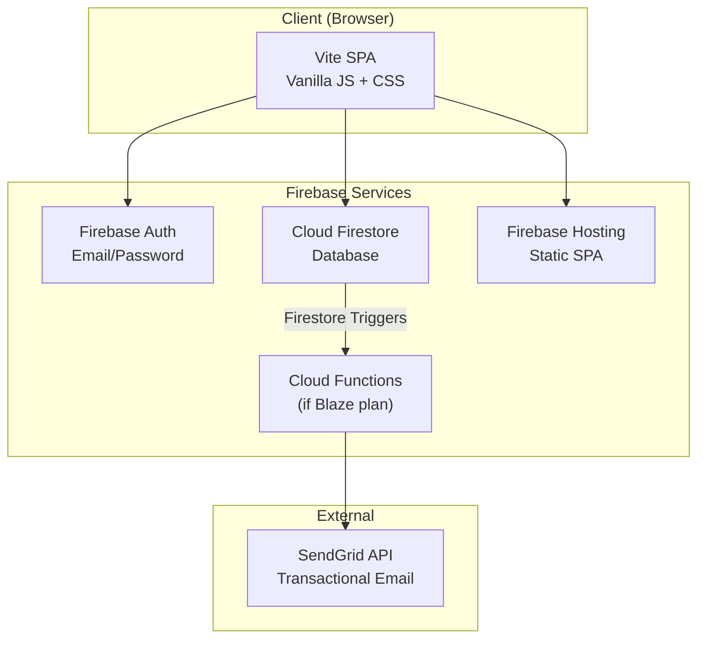

# Vanpool Coordinator — Implementation Plan

## Overview

A mobile-first SPA for coordinating a vanpool of ~10 members. Users can view a calendar of rides, create/claim/RSVP for rides, and manage their profiles. Admins can manage users and export historical reports.

## User Review Required

> [!IMPORTANT]
> **Firebase Project**: Do you have an existing Firebase project, or should I create a new one? I'll need either:
> - An existing Firebase Project ID, **or**
> - Approval to create a new project (e.g., `vanpool-coordinator`)

> [!IMPORTANT]
> **SendGrid Account**: Email notifications require a SendGrid account (free tier: 100 emails/day). Do you already have one, or should I stub the email functions so you can configure SendGrid credentials later?

> [!WARNING]
> **Email-link sign-in vs. Email/Password with invite**: Firebase supports two invite flows:
> 1. **Email-link sign-in** (passwordless) — Admin adds user → Firebase sends a magic link → user clicks to sign in. Simplest, but no password is ever set.
> 2. **Admin creates user via Cloud Function** → Cloud Function creates Firebase Auth user with a temp password → sends custom invite email via SendGrid with a "set your password" link → user resets password on first login.
>
> Your spec says users "create a password upon initial login using the link in the email." This matches **Option 2**. However, Option 2 requires **Cloud Functions** (Blaze/pay-as-you-go plan) — the free Spark plan does not support Cloud Functions.
>
> **Alternatives on the free Spark plan:**
> - Use **email-link (passwordless) sign-in** instead of passwords (Option 1). Users sign in via a magic link each time — no passwords needed.
> - Use the admin UI to manually share a temporary password, and users change it on first login (no Cloud Function needed, but not automated).
>
> Which approach do you prefer?

## Open Questions

> [!IMPORTANT]
> **Vanpool Time Zone**: What time zone should the app use? (e.g., `America/Los_Angeles`, `America/Denver`). This will be hard-coded since the vanpool is always in one time zone.

> [!IMPORTANT]
> **Admin Bootstrap**: Who is the first admin? Should I seed the Firestore database with an initial admin user document, or should the first user to sign up automatically become an admin?

> [!NOTE]
> **Historical Export**: You mentioned admins should be able to export a historical report of who drove for specified date ranges. Should this be a CSV download, or is a printable HTML table sufficient?

---

## Architecture



### Technology Choices

| Layer | Choice | Rationale |
|---|---|---|
| **Frontend Framework** | Vite + Vanilla JS | Lightweight, fast builds, no framework overhead. SPA routing via hash-based router. |
| **Styling** | Vanilla CSS with custom properties | Full control, mobile-first responsive design, dark mode support. |
| **Auth** | Firebase Auth (Email/Password) | Built-in password hashing, reset flows, session management. |
| **Database** | Cloud Firestore (Standard) | Free tier (1 GiB storage, 50K reads/day) is plenty for ~10 users. Real-time listeners for live calendar updates. |
| **Hosting** | Firebase Hosting | Free SSL, global CDN, SPA rewrite support. |
| **Email** | SendGrid (via Cloud Functions) | Free tier: 100 emails/day — more than sufficient. Triggered by Firestore writes. |
| **Profile Photos** | Base64 in Firestore | ~10 users × ~50KB compressed = ~500KB total. Well within free Firestore limits. Photos resized client-side to ≤ 200×200px before encoding. |

---

## Data Model

### Collection: `users`

| Field | Type | Required | Constraints | Mutable |
|---|---|---|---|---|
| `firstName` | string | ✅ | 1–50 chars | ✅ (self or admin) |
| `lastName` | string | ✅ | 1–50 chars | ✅ (self or admin) |
| `email` | string | ✅ | Valid email, ≤ 254 chars | ✅ (self or admin) |
| `role` | string | ✅ | `"Driver"` or `"Rider"` | ✅ (admin only) |
| `isAdmin` | boolean | ✅ | `true` / `false` | ✅ (admin only) |
| `photoBase64` | string | ❌ | ≤ 75,000 chars (~55KB image) | ✅ (self or admin) |
| `createdAt` | timestamp | ✅ | Server timestamp | ❌ |
| `updatedAt` | timestamp | ✅ | Server timestamp | ✅ |

- **Document ID** = Firebase Auth UID
- Password is **never** stored in Firestore — it lives exclusively in Firebase Auth.

### Collection: `rides`

| Field | Type | Required | Constraints | Mutable |
|---|---|---|---|---|
| `date` | string | ✅ | `YYYY-MM-DD` format | ✅ (admin or driver) |
| `departureFromTC` | string | ✅ | `HH:MM` format (24h) | ✅ (admin or driver) |
| `departureFromWork` | string | ✅ | `HH:MM` format (24h) | ✅ (admin or driver) |
| `status` | string | ✅ | `"requested"` or `"scheduled"` | ✅ (see rules) |
| `driverId` | string \| null | ❌ | Must be a valid user UID when status is `"scheduled"` | ✅ (see rules) |
| `driverName` | string \| null | ❌ | Denormalized `firstName lastName` | ✅ |
| `rsvps` | array\<string\> | ✅ | Array of user UIDs, max 7 | ✅ |
| `createdBy` | string | ✅ | UID of creator | ❌ |
| `createdAt` | timestamp | ✅ | Server timestamp | ❌ |
| `updatedAt` | timestamp | ✅ | Server timestamp | ✅ |

### Collection: `notifications` (outbound email queue)

| Field | Type | Required | Description |
|---|---|---|---|
| `type` | string | ✅ | `"ride_claimed"`, `"ride_cancelled"`, `"ride_requested"`, `"user_invite"` |
| `recipientEmails` | array\<string\> | ✅ | Email addresses to notify |
| `subject` | string | ✅ | Email subject line |
| `body` | string | ✅ | Email body (HTML) |
| `processed` | boolean | ✅ | Set to `true` after Cloud Function sends |
| `createdAt` | timestamp | ✅ | Server timestamp |

A Cloud Function triggers on `notifications` collection writes, sends via SendGrid, and marks `processed: true`.

---

## Proposed Changes

### Frontend — Vite SPA

#### [NEW] `package.json`
Initialize a Vite project with `firebase` SDK as the only production dependency.

#### [NEW] `vite.config.js`
Standard Vite config for SPA.

#### [NEW] `index.html`
Single HTML entry point. Meta tags for mobile viewport, SEO, and PWA-ready manifest link.

---

#### [NEW] `src/firebase.js`
Firebase app initialization, Auth, and Firestore exports.

#### [NEW] `src/router.js`
Hash-based SPA router (`#/login`, `#/calendar`, `#/rides/new`, `#/rides/:id`, `#/profile`, `#/admin/users`, etc.). Guards routes behind auth state and admin checks.

#### [NEW] `src/main.js`
App entry point. Initializes Firebase, sets up auth state listener, boots the router.

---

### CSS Design System

#### [NEW] `src/styles/index.css`
Root CSS file that imports all other stylesheets. Defines:
- CSS custom properties (colors, spacing, typography, shadows, radii)
- Dark mode via `prefers-color-scheme` and a manual toggle
- Mobile-first responsive breakpoints
- Base element resets

#### [NEW] `src/styles/components.css`
Reusable component styles: buttons, cards, modals, inputs, badges, avatars, navigation, calendar cells.

#### [NEW] `src/styles/calendar.css`
Calendar-specific grid layout, day cell states (empty, requested, scheduled, today), animations.

#### [NEW] `src/styles/forms.css`
Form layout, input styling, validation states, floating labels.

---

### Feature Modules

#### [NEW] `src/views/login.js`
- Email/password sign-in form
- Password reset link → Firebase `sendPasswordResetEmail()`
- Redirect to calendar on successful auth
- Handle email-link completion if using passwordless flow

#### [NEW] `src/views/calendar.js`
- **Monthly calendar grid** showing current month
- Navigation: forward months only (no past months)
- Each day cell shows ride status with color coding:
  - 🟢 Green = Scheduled (has a driver)
  - 🟡 Amber = Requested (needs a driver)
  - ⬜ Empty = No ride
- Tap a day → opens ride detail or "add ride" if empty
- Real-time listener (`onSnapshot`) on rides collection filtered by visible month
- Responsive: 7-column grid on desktop, scrollable week view on small mobile

#### [NEW] `src/views/ride-detail.js`
- Shows: date, departure times, status, driver (if scheduled), RSVP list with count (`X/7`)
- **RSVP button**: Riders can RSVP / un-RSVP. Disabled at 7 riders.
- **Claim button**: Visible to Drivers when status is `"requested"`. Sets `driverId` to current user and status to `"scheduled"`.
- **Edit button**: Visible to the ride's driver or any admin.
- **Cancel button**: Visible to the ride's driver or any admin. Deletes the ride document.

#### [NEW] `src/views/ride-form.js`
- **Add / Edit ride form**
- Fields: date (default: today), departure from TC (default: 05:55), departure from work (default: 15:00), status
- **Rider role**: Status locked to `"requested"`, driver field hidden.
- **Driver role**: Can choose `"requested"` or `"scheduled"`. If `"scheduled"`, driver auto-populates with self.
- **Recurring options**: "One-time" (default), "Repeat daily (Mon–Fri)", "Repeat weekly". If recurring, an **end date** is required. On submit, individual ride documents are created for each occurrence.
- Date picker prevents selecting past dates.

#### [NEW] `src/views/profile.js`
- Edit: first name, last name, email, profile photo
- Photo upload with client-side resize (≤ 200×200px, JPEG, ≤ 50KB) → stored as base64 in Firestore
- Read-only display of role and admin status

#### [NEW] `src/views/admin-users.js`
- **Visible only to admins** (router guard)
- User list: thumbnail photo, full name, role badge
- **Add user**: Form with name, email, role, isAdmin. On submit:
  1. Creates Firestore `users` document
  2. Writes to `notifications` collection to trigger invite email
  3. (If Blaze plan) Cloud Function creates Firebase Auth user and sends invite
- **Edit user**: All fields editable except password (not shown)
- **Remove user**: Deletes Firestore doc (and optionally disables Auth account via Cloud Function)

#### [NEW] `src/views/admin-export.js`
- **Visible only to admins**
- Date range picker (start date, end date)
- Queries rides in the range, groups by driver
- Generates a downloadable CSV: `Date, Driver Name, Status, RSVP Count`

---

### Shared Utilities

#### [NEW] `src/utils/auth.js`
- `getCurrentUser()` — returns current Firebase Auth user
- `getUserProfile(uid)` — fetches user doc from Firestore
- `isAdmin(uid)` — checks user's `isAdmin` field
- `isDriver(uid)` — checks user's `role` field

#### [NEW] `src/utils/rides.js`
- `getRidesForMonth(year, month)` — queries rides collection
- `createRide(data)` / `updateRide(id, data)` / `deleteRide(id)`
- `claimRide(rideId, driverUid, driverName)` — atomic update
- `toggleRsvp(rideId, userId)` — add/remove from rsvps array (with capacity check)
- `createRecurringRides(baseRide, pattern, endDate)` — generates individual ride docs

#### [NEW] `src/utils/users.js`
- `getAllUsers()` / `getUser(uid)` / `createUser(data)` / `updateUser(uid, data)` / `deleteUser(uid)`
- `resizeAndEncodePhoto(file)` — client-side image resize → base64

#### [NEW] `src/utils/notifications.js`
- `queueNotification(type, recipientEmails, subject, body)` — writes to `notifications` collection
- Template functions for each notification type

#### [NEW] `src/components/` (shared UI components)
- `nav.js` — Bottom navigation bar (Calendar, Profile, Admin)
- `modal.js` — Reusable modal dialog
- `toast.js` — Toast notification system
- `avatar.js` — User avatar component (base64 or initials fallback)
- `badge.js` — Role/status badges

---

### Firebase Configuration

#### [NEW] `firebase.json`
```json
{
  "hosting": {
    "public": "dist",
    "ignore": ["firebase.json", "**/.*", "**/node_modules/**"],
    "rewrites": [{ "source": "**", "destination": "/index.html" }],
    "cleanUrls": true,
    "trailingSlash": false
  },
  "auth": {
    "providers": {
      "emailPassword": true
    }
  },
  "firestore": {
    "rules": "firestore.rules",
    "indexes": "firestore.indexes.json"
  },
  "functions": {
    "source": "functions"
  }
}
```

#### [NEW] `firestore.rules`
Comprehensive security rules implementing:
- Default deny all
- Authentication required for all operations
- Users collection: self-read/update for own doc, admin read/write all, no self-role-escalation
- Rides collection: authenticated read, create with role-based status constraints, update/delete by driver or admin, RSVP array validation (max 7)
- Notifications collection: authenticated create, no client reads (Cloud Function only)
- Full data validation (types, lengths, enums, required fields)

#### [NEW] `firestore.indexes.json`
Composite indexes for:
- `rides`: `date` ASC (for month range queries)

---

### Cloud Functions (if Blaze plan)

#### [NEW] `functions/package.json`
#### [NEW] `functions/index.js`

Two functions:
1. **`onNotificationCreated`** — Firestore trigger on `notifications` collection. Sends email via SendGrid, marks `processed: true`.
2. **`onUserCreated`** — HTTP callable function for admin to create a Firebase Auth user and trigger the invite notification.

---

## File Structure

```
vanpool-coordinator/
├── index.html
├── package.json
├── vite.config.js
├── firebase.json
├── .firebaserc
├── firestore.rules
├── firestore.indexes.json
├── functions/
│   ├── package.json
│   └── index.js
├── public/
│   └── favicon.svg
└── src/
    ├── main.js
    ├── firebase.js
    ├── router.js
    ├── styles/
    │   ├── index.css
    │   ├── components.css
    │   ├── calendar.css
    │   └── forms.css
    ├── views/
    │   ├── login.js
    │   ├── calendar.js
    │   ├── ride-detail.js
    │   ├── ride-form.js
    │   ├── profile.js
    │   ├── admin-users.js
    │   └── admin-export.js
    ├── components/
    │   ├── nav.js
    │   ├── modal.js
    │   ├── toast.js
    │   ├── avatar.js
    │   └── badge.js
    └── utils/
        ├── auth.js
        ├── rides.js
        ├── users.js
        └── notifications.js
```

---

## Verification Plan

### Automated Tests
```bash
# Build verification
npm run build

# Lint check
npx eslint src/

# Firestore rules validation (requires firebase-tools)
npx -y firebase-tools@latest emulators:exec --only firestore "echo 'Rules compiled successfully'"
```

### Manual Verification
1. **Auth flow**: Sign in, sign out, password reset
2. **Calendar**: Navigate months (forward only), verify ride indicators
3. **Ride CRUD**: Create (one-time + recurring), view detail, edit, cancel
4. **Claim ride**: Driver claims a requested ride → status changes
5. **RSVP**: Rider RSVPs, verify count, test 7-rider cap
6. **Profile**: Edit name, email, upload photo (verify resize + base64)
7. **Admin — User management**: Add, edit, remove users
8. **Admin — Export**: Generate CSV for date range
9. **Notifications**: Verify emails sent for ride_claimed, ride_cancelled, ride_requested
10. **Mobile responsiveness**: Test on 375px viewport width
11. **Security**: Attempt unauthorized actions (role escalation, editing others' rides, bypassing admin guard)
