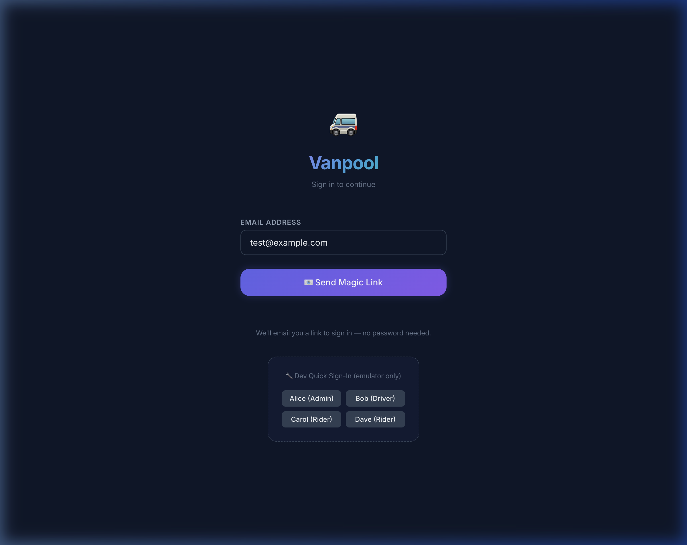
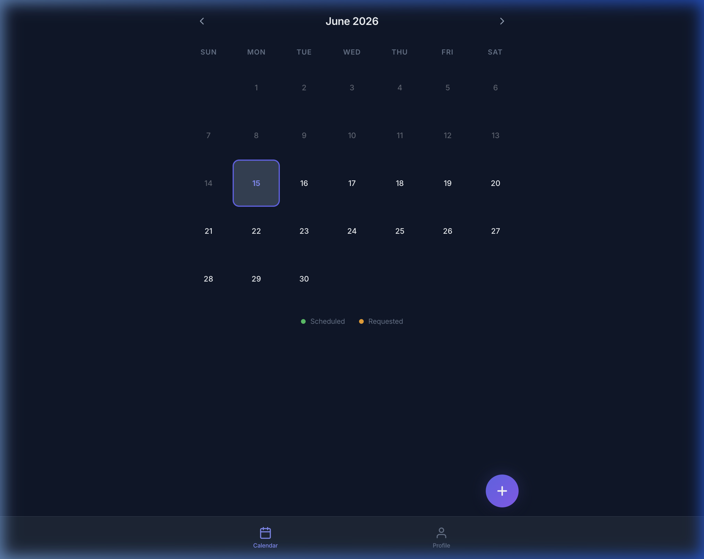

# Vanpool Coordinator: User Guide

Welcome to the Vanpool Coordinator! This mobile-friendly application is designed to make coordinating daily rides, volunteering to drive, and reserving your seat as easy as possible for your vanpool group.

## 1. Getting Started: Logging In
Say goodbye to forgotten passwords! The app uses a secure, passwordless authentication system called **Magic Links**.

1. Enter your email address on the login screen.
2. Check your email inbox for a secure login link.
3. Click the link, and you'll be automatically signed into the application.

> [!NOTE]
> If you are the very first person to log into your group's app, you will automatically be assigned the **Admin** role to help bootstrap the group.

## 2. The Calendar Interface
The heart of the Vanpool Coordinator is the **Visual Calendar**. Designed with a sleek, dynamic dark-mode interface and smooth animations, the calendar gives you a complete monthly overview of your group's travel plans.

* **View Rides:** Instantly see which days have scheduled rides, open requests, and who the assigned drivers are.
* **Interact:** Tap on any day to view details, see the current passenger list, RSVP, or volunteer to drive.

## 3. User Roles & What You Can Do
Your capabilities in the app depend on your assigned role. Everyone can view the calendar, but actions are tailored to your permissions.

### 🚐 For Riders
* **Request a Ride:** Need a lift on a specific day? Submit a new ride request so drivers know someone needs to go into the office.
* **RSVP to a Ride:** Reserve your seat on a scheduled ride. *Please note: To ensure everyone has a seat, each ride has a maximum capacity of 7 riders.*

### 🚘 For Drivers
Drivers have all the capabilities of Riders, plus the ability to manage the wheel:
* **Claim Open Requests:** See a pending ride request on the calendar? You can step up, claim it, and officially assign yourself as the driver.
* **Schedule New Rides:** Proactively schedule a ride on the calendar and assign yourself as the driver so others can start RSVPing early.

### ⚙️ For Administrators
Admins oversee the smooth operation of the vanpool. They have all the capabilities of Drivers, plus:
* **Manage Users & Roles:** Approve users and assign or upgrade roles (e.g., promoting a Rider to a Driver).
* **Manage the Calendar:** Admins have the authority to delete or modify any ride on the calendar if plans change or mistakes are made.
* **Export Data:** Download vanpool data for records, reporting, or cost-sharing calculations.

## 4. Automated Notifications
You don't need to constantly check the app to stay updated. The Vanpool Coordinator will automatically send you email notifications to keep everyone in the loop whenever:
* A new ride is requested by a rider.
* A driver claims an open ride request.
* A scheduled ride is cancelled.

---
*Enjoy your streamlined commute with Vanpool Coordinator!*
